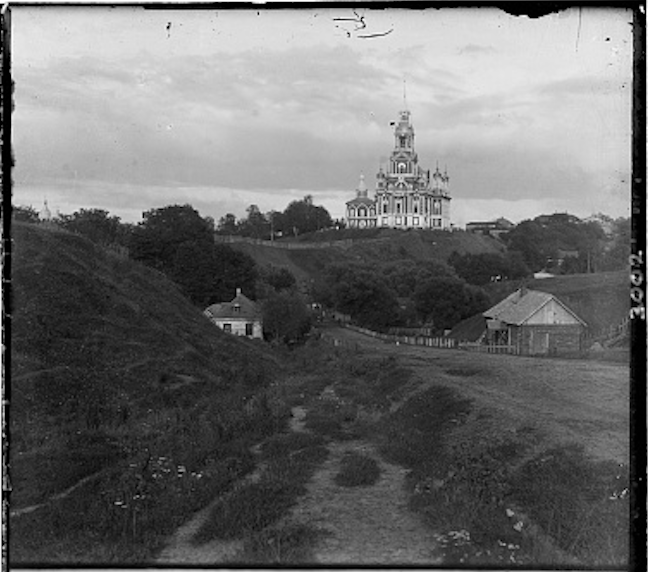
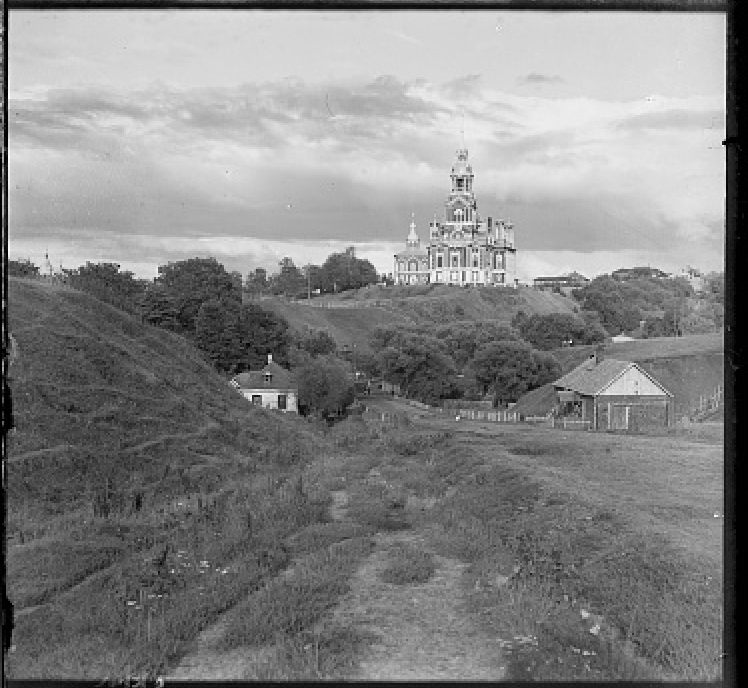
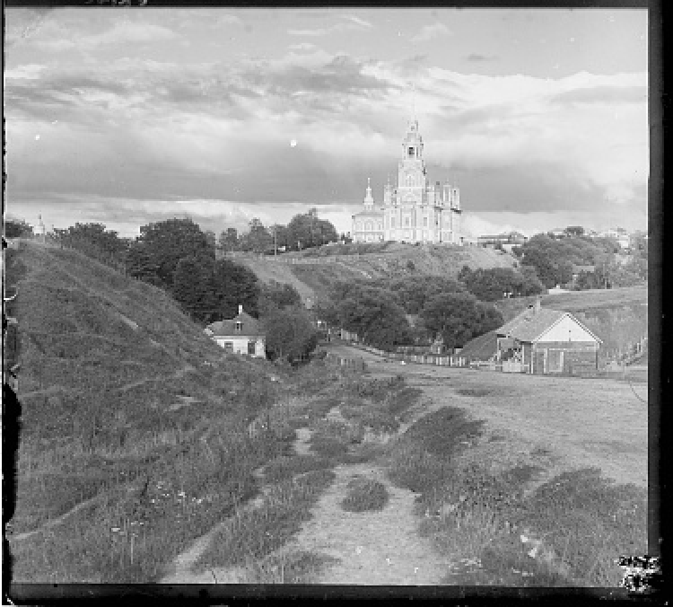

## Colorizing the Prokudin-Gorskii Photo Collection

Formally, let $I_1(x, y), I_2(x, y)$ denote the intensity at $(x, y)$. We want to estimate a translation $(\Delta x, \Delta y)$ such that the transformed image $I_1$ is as close as possible to $I_2$. In other words, we solve the optimization problem

$$\Delta x^*, \Delta y^* = \underset{\Delta x, \Delta y}{\text{argmin}} \sum_{x, y} (I_1(x+\Delta x, y+\Delta y) - I_2(x, y))^2$$

We can as well use other metrics such as mean absolute error or normalized cross correlation to measure the distance between the transformed image and the base image. For the rest of our work, we will be aligning the red and green to the blue channel. 

  
  
  

